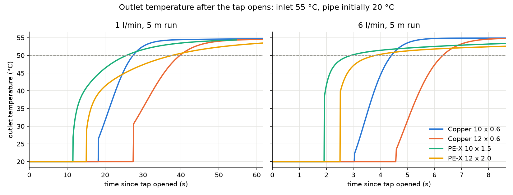
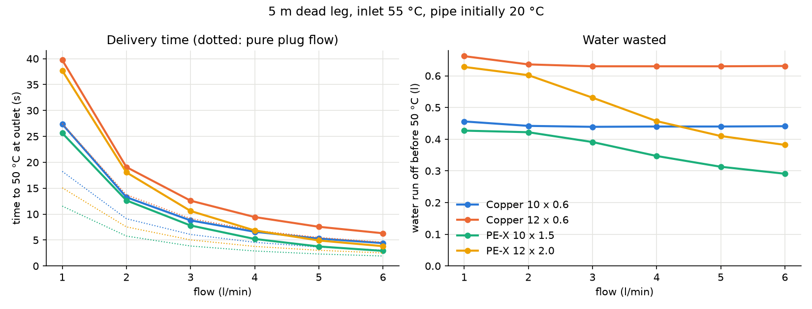
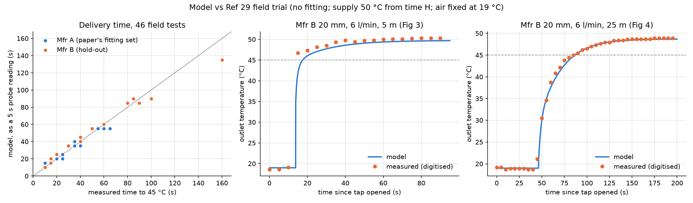
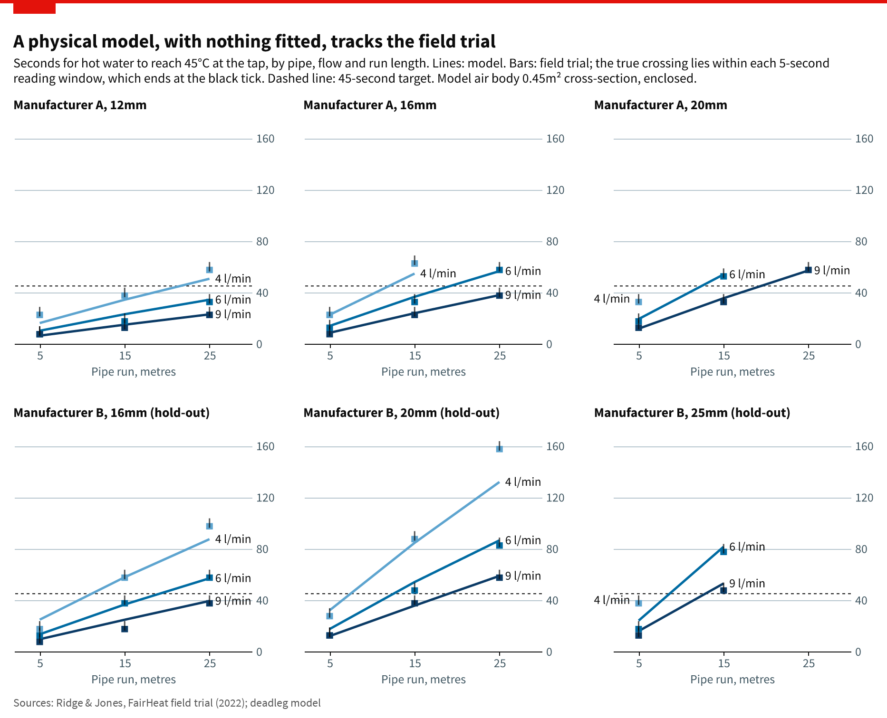
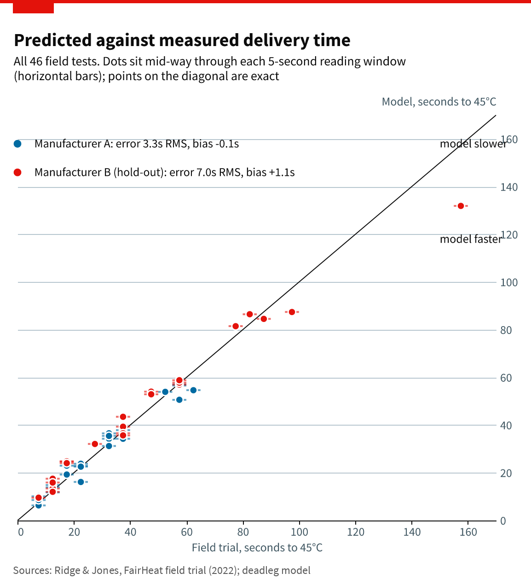
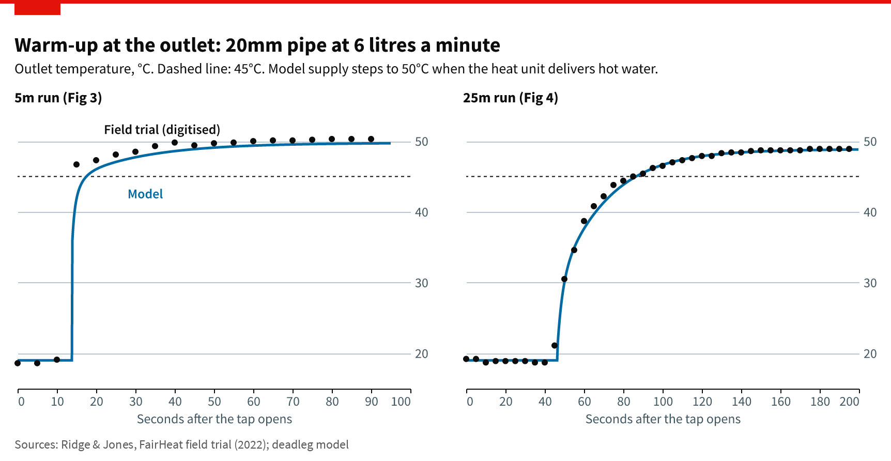

# deadleg: transient model of hot water reaching a cold tap

How long does it take, and how much water is run off, before hot water arrives
at a tap at the end of a cold domestic hot water pipe? This repository contains a
theoretical model of that transient and a Python implementation of it.

The model follows hot water as it displaces the cold water already in the pipe
and tracks four coupled heat flows:

* the water flowing along the pipe (plug flow, temperature varying along the pipe);
* heat transfer from the water to the pipe wall (forced convection);
* the warming of the pipe wall, which is homogeneous and axially symmetric, with
  conduction both through its thickness and along its length;
* heat transfer from the wall to a single, well mixed body of air (natural
  convection plus radiation), whose temperature rises as the pipe warms it.

Everything starts at the same temperature as the air. The full derivation, the
assumptions and the numerical method are in [docs/derivation.md](docs/derivation.md).

## Quick start

```bash
pip install -e ".[plots,test]"
python -m pytest                       # verification tests (about 15 s)
python -m deadleg run scenarios/copper_10mm_3lpm.json
python examples/sweep.py               # copper and PE-X, 1-6 l/min -> results/sweep
python examples/ref29_validation.py /path/to/ref29   # field trial comparison -> results/ref29
python examples/ref29_validation.py /path/to/ref29 --air-area 0.45 --out results/ref29_air_1.5x0.3m
(cd examples && python ref29_plots.py ../results/ref29_air_1.5x0.3m --air-area 0.45 --data /path/to/ref29 --fonts /path/to/SourceSansPro)
```

From Python:

```python
from deadleg import PRESETS, Scenario, simulate

sc = Scenario(PRESETS["pex_12x2.0"], length=5, flow=3, duration=60, T_initial=20, T_inlet=55)
r = simulate(sc)
r.time_to_reach(50), r.volume_to_reach(50)   # s, litres
r.t, r.T_out                                 # outlet temperature history
```

`Scenario` also takes a flow schedule (e.g. draw, pause, draw), a time-varying
inlet temperature (a function or a measured table), the air volume (or `math.inf`
for a large room), heat loss from the air body to an environment, and fixed
heat transfer coefficients for sensitivity studies. Pipe presets are in
`deadleg/pipes.py`; any size and material can be built with `make_pipe`.
Scenario files (`scenarios/*.json`, format in `deadleg/io.py`) and
`python -m deadleg compare scenario.json measured.csv` make it straightforward to
set up a test rig case and compare it with a logged outlet trace.

## Results: 5 m dead leg, inlet 55 °C, pipe and air initially 20 °C

From `examples/sweep.py` (full table in `results/sweep/sweep.csv`). Default air body:
a 100 × 100 mm enclosed void along the pipe, no loss from it.

| Pipe | Water volume (l) | Flow (l/min) | Plug-flow time (s) | Time to 40 °C (s) | Time to 50 °C (s) | Water to 50 °C (l) |
|---|---|---|---|---|---|---|
| Copper 10 × 0.6 | 0.30 | 1 | 18.2 | 22.8 | 27.4 | 0.46 |
| | | 3 | 6.1 | 7.6 | 8.8 | 0.44 |
| | | 6 | 3.0 | 3.8 | 4.4 | 0.44 |
| Copper 12 × 0.6 | 0.46 | 1 | 27.5 | 32.6 | 39.7 | 0.66 |
| | | 3 | 9.2 | 11.0 | 12.6 | 0.63 |
| | | 6 | 4.6 | 5.5 | 6.3 | 0.63 |
| PE-X 10 × 1.5 | 0.19 | 1 | 11.5 | 14.5 | 25.6 | 0.43 |
| | | 3 | 3.8 | 4.2 | 7.8 | 0.39 |
| | | 6 | 1.9 | 2.0 | 2.9 | 0.29 |
| PE-X 12 × 2.0 | 0.25 | 1 | 15.1 | 18.8 | 37.7 | 0.63 |
| | | 3 | 5.0 | 5.4 | 10.6 | 0.53 |
| | | 6 | 2.5 | 2.5 | 3.8 | 0.38 |




What the model says:

* **Copper behaves as a lumped heat capacity.** The thin, highly conductive wall
  heats through its thickness almost at once, so it simply absorbs heat from the
  leading water. The water wasted before 50 °C is about 1.4–1.5 times the pipe's
  water volume and hardly depends on flow; the time scales as 1/flow.
* **Plastic is different: the first warm water arrives early, the last few
  degrees arrive late.** PE-X conducts about 1000 times worse than copper, so
  only a thin inner skin of the wall heats while water passes. Warm (40 °C) water
  arrives close to the plug-flow time, but reaching 50 °C waits on heat soaking
  into the wall. At low flow this makes PE-X as slow as copper of the same OD to
  50 °C despite holding much less water; at high flow it is faster.
* **The threshold matters as much as the pipe.** For plastic, "time to 40 °C" and
  "time to 50 °C" differ by a factor of up to two, so a delivery time is only
  meaningful with its temperature (and the supply temperature) stated.

## Check against field data (Ref 29)

Ridge & Jones (FairHeat, 2022) measured the time to 45 °C at the end of
5–25 m runs of 12–25 mm MLCP pipe at 4–9 l/min, starting from about 19 °C.
`examples/ref29_validation.py` runs all 46 tests with no fitting: inlet steps from
19 °C to 50 °C (the steady outlet temperature in the paper's traces) at the
measured HIU-plus-manifold time H; MLCP is a homogenised material
(`deadleg.properties.MLCP`); air fixed at 19 °C.

| | Model bias (s) | Model RMSE (s) | Paper's regression bias (s) | Paper's regression RMSE (s) |
|---|---|---|---|---|
| Manufacturer A (the paper fitted its formula to these) | −0.1 | 3.3 | +3.1 | 4.3 |
| Manufacturer B (hold-out) | +1.1 | 6.9 | +6.2 | 8.9 |

Errors are against the middle of each 5 s reading window (the probe was read every
5 s, so the true crossing lies up to 5 s before the reported time).



### With an enclosed air body of 1.5 m × 0.3 m

Rerunning the 46 tests with the pipe in an enclosed 1.5 m × 0.3 m air body
(0.45 m² cross-section along the run, starting at 19 °C,
`--air-area 0.45`) leaves the errors almost unchanged: Manufacturer A has bias
−0.1 s and RMSE 3.3 s; Manufacturer B has bias +1.1 s and RMSE 7.0 s. No
delivery time moves by more than 0.34 s, and the air warms by at most 7 K
(to 26 °C) in the longest test. During a draw lasting one or two minutes,
almost all of the heat goes into the wall and the water. The outer surface
loses only a few watts per metre, so the air body has little effect.
Charts (Altair, `examples/ref29_plots.py`):





The model reproduces the shape of the 25 m trace closely (RMSE 0.5 °C) and the
5 m trace to within the uncertainty of the inlet. Its largest misses are the
slow, long, large-bore tests (Mfr B 20 mm × 25 m at 4 l/min: 132 s against 160 s;
Mfr A 16 mm × 15 m at 4 l/min: 55 s against 65 s). Likely causes, not yet
tested: the HIU supplying cooler water at 4 l/min than the assumed 50 °C (45 °C
is close to the supply temperature, so a degree matters a lot), and
transitional flow (Re about 5000 to 10000) being less well mixed than the
correlation assumes.

## Layout

```
deadleg/properties.py   water, air and wall material properties
deadleg/pipes.py        pipe geometry and presets
deadleg/correlations.py inside and outside heat transfer coefficients
deadleg/model.py        Scenario, simulate(), Result
deadleg/analytic.py     Anzelius-Schumann and steady-state solutions (verification)
deadleg/io.py           JSON scenarios, CSV export, comparison with measured traces
docs/derivation.md      equations, assumptions, numerics, verification, limitations
examples/               parameter sweep and Ref 29 comparison
tests/                  verification tests
```
